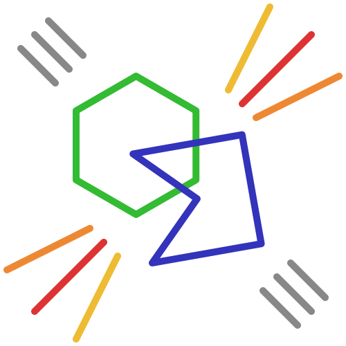

# collision.py

## Info

Collision is a python library meant for collision detection between convex and concave polygons, circles, and points.

### Insallation

To get the latest development version:

`pip install https://github.com/QwekoDev/collision/archive/master.zip`

## Classes

### ***class*** `collision.Vector(x, y)`

A 2D vector/point class

**Properties:**

- `x` *(int) or (float)* - The x-coordinate
- `y` *(int) or (float)* - The y-coordinate

**Methods:**

##### *func* `copy()` &rarr; `collision.vec`

Return a copy of the vector

##### *func* `set(v)`

Copy another vectors values onto the vector

- `v` *(collision.vec)* - The vector to copy from

##### *func* `perp()` &rarr; `collision.vec`

Return the vector rotated perpandicularly

##### *func* `rotate(angle)` &rarr; `collision.vec`

Return the vector rotated the angle

- `angle` *(int) or (float)* - Radians to rotate the point

##### *func* `reverse()` &rarr; `collision.vec`

Return a reversed version of the vector

##### *func* `normalize()` &rarr; `collision.vec`

Return a normalized version of the vector

##### *func* `project(v)` &rarr; `collision.vec`

Return the vector projected onto the passed vector

- `v` *(collision.vec)* - The vector to project upon

##### *func* `project_n(v)` &rarr; `collision.vec`

Return the vector projected onto a unit vector

- `v` *(collision.vec)* - The vector to project upon

##### *func* `reflect(axis)` &rarr; `collision.vec`

Return the vector reflected upon the passed axis vector

- `axis` *(collision.vec)* - The axis to reflect upon

##### *func* `reflect_n(axis)` &rarr; `collision.vec`

Return the vector reflected upon the passed axis unit vector

- `axis` *(collision.vec)* - The axis to reflect upon

##### *func* `dot(v)` &rarr; `int or float`

Returns the dot product of the vector and another

- `v` *(collision.vec)* - The other vector for the dot product

##### *func* `ln()` &rarr; `int or float`

Returns the length of the vector

##### *func* `ln2()` &rarr; `int or float`

Returns the squared length of the vector

------

### ***class*** `collision.Circle(pos, radius)`

A simple circle with a position and radius

**Properties:**

- `pos` *(collision.vec)* - The center coordinate of the circle
- `radius` *(int) or (float)* - The radius of the circle
- `aabb` *(tuple(tuple(int or float))* - The axis alligned bounding box of the circle

### ***class*** `collision.Poly(pos, points, angle = 0)`

A **convex** polygon with a position, a list of points relative to that position, and an angle

**Properties:**

- `pos` *(collision.vec)* - The center coordinate of the circle
- `points` *(list[collision.vec])* - A list of absolute points (each relative point + the position of the polygon.) Can not be directly edited.
- `rel_points` *(list[collision.vec])* - A list of points relative to the position. This property should not be directly changed.
- `angle` *(int) or (float)* - The angle which the polygon is rotated. Changing this will cause the polygon to be recalculated.
- `aabb` *(tuple(tuple(int or float))* - The axis alligned bounding box of the Poly

**Class Methods:**

##### *func* `Poly.from_box(pos, width, height)` &rarr; `collision.Poly`

Creates a polygon from

- `pos` *(collision.vec)* - The center coordinate of the polygon/box
- `width` *(int) or (float)* - The width of the box
- `height` *(int) or (float)* - The height of the box

**Methods:**

##### *func* `set_points(points)`

Change the base points relative to the position. After this is done, the polygon will be recalculated again. Angle will be preserved. Use this instead of editing the `points` property.

##### *func* `get_centroid()` &rarr; `collision.vec`

Get the centroid of the polygon. The arithmatic mean of all of the points.

------

### ***class*** `collision.Concave_Poly(pos, points, angle = 0)`

A **concave** polygon with a position, a list of points relative to that position, and an angle. This takes longer to collide than a regular `Poly` does, so only use this if your shape must be concave.

**Properties:**

- `pos` *(collision.vec)* - The center coordinate of the circle
- `points` *(list[collision.vec])* - A list of absolute points (each relative point + the position of the polygon.) Can not be directly edited.
- `rel_points` *(list[collision.vec])* - A list of points relative to the position. This property should not be directly changed.
- `tris` *(list[collision.Poly])* - A list of triangles relative to the position on the poly that make up the concave polygon. Used for concave collisions.
- `angle` *(int) or (float)* - The angle which the polygon is rotated. Changing this will cause the polygon to be recalculated.
- `aabb` *(tuple(tuple(int or float))* - The axis alligned bounding box of the Poly

**Methods:**

##### *func* `set_points(points)`

Change the base points relative to the position. After this is done, the polygon will be recalculated again. Angle will be preserved. Use this instead of editing the `points` property.

##### *func* `get_centroid()` &rarr; `collision.vec`

Get the centroid of the polygon. The arithmatic mean of all of the points.

------

### ***class*** `collision.Response()`

The result of a collision between two objects. May optionally be passed to collision tests to retrieve additional information. At its cleared state, it may seem to have odd values. Ignore these, they are just there to make generating the response more efficient. The response should be ignored unless there is a successful collision.

**Properties:**

- `a` *(collision shape)* - The first object in the collision test
- `b` *(collision shape)* - The second object in the collision test
- `overlap` *(int) or (float)* - Magnitude of the overlap on the shortest colliding axis
- `overlap_n` *(collision.vec)* - The shortest colliding axis (unit vector)
- `overlap_v` *(collision.vec)* - The overlap vector. If this is subtracted from the position of `a`, `a` and `b` will no longer be colliding.
- `a_in_b` *(bool)* - Whether `a` is fully inside of `b`
- `b_in_a` *(bool)* - Whether `b` is fully inside of `a`

**Methods:**

##### *func* `reset()` &rarr; `collision.Response`

Reset the Response for re-use, and returns itself

## Collisions

### *func* `collision.collide(a, b, response = None)` &rarr; `bool`

Test two shapes against each other. If a response is passed, and there is a collision, that response will be updated to the response values. **The response will not be generated if there is no collision and it will be at it's default values.**

- `a` *(collision shape)* - The first shape to test
- `b` *(collision shape)* - The second shape to test
- `response` *(collision.Response)* - Optional response that will be updated if there is a collision.

### *func* `collision.test_aabb(a, b)` &rarr; `bool`

Test two axis aligned bounding boxes against each other. This is already done in `collision.collide` so there is no need for you to do it for optimization.

- `a` *(tuple(tuple(int or float)))* The first AABB
- `b` *(tuple(tuple(int or float)))* The second AABB
